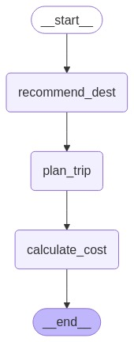

# Multi-Agent Travel Planner using LLM

This project is an intelligent, multi-agent travel planning assistant built with **LangChain**, **LangGraph**, and **OpenRouter LLMs**. It helps users plan a trip by recommending destinations, generating personalized itineraries, estimating travel costs, and providing real-time assistance, all in a seamless pipeline powered by natural language processing.

- The workflow below shows the Travel planing agents and the workflow:

<p align="center">
  
</p>

---

## ✨ Main Components & Features

- 🧠 **Destination Recommender**: Detects a city from user input or suggests one based on interests and budget.
- 📅 **Itinerary Generator**: Builds a 3-day, city-specific, personalized travel plan.
- 💰 **Cost Estimator**: Analyzes the generated itinerary to compute a realistic total cost.
- 🤖 **Real-Time Assistant**: Helps the users during the trip with questions about restaurants, transport, and safety.

---

## Tech Stack

| Tool        | Description                                      |
|-------------|--------------------------------------------------|
| `LangChain` | Orchestration framework for LLM applications     |
| `LangGraph` | Graph-based multi-agent workflow engine          |
| `OpenRouter`| Multi-model LLM API aggregator (Claude, GPT, etc.)|
| `Python`    | The Core implementation language                 |

---

## 🔍 How It Works

The system follows a modular, graph-based workflow:

1. **recommend_dest** → Detect or suggest a travel destination.
2. **plan_trip** → Generate a detailed 3-day itinerary.
3. **calculate_cost** → Estimate cost based on the itinerary.
4. ✅ **END** → Return a complete travel plan to the user.

Each agent communicates using a shared state (`TravelState`), enabling memory persistence and logical flow.

---

## 🚀 Example Usage

```bash
Enter destination city: cairo
Enter your interests (comma-separated): food, music, art, history
Enter your budget ($): 3000
```

---

## ✅ Output

```text
## Travel Plan for Cairo

### Itinerary:
Day 1: Visit the Egyptian Museum, enjoy traditional lunch, tour Cairo Citadel, attend live music at El Sawy.

Day 2: Explore Giza Pyramids, shop at Khan El Khalili, watch Tanoura dance at Wekalet El Ghouri.

Day 3: Discover Islamic & Coptic Cairo, dine at Zooba, enjoy a Nile dinner cruise.

### Estimated Cost: $1800.00  
💰 You'll save $1200.00 under your budget!
```

---

## 💬 Ask your Real-Time Assistant

### Input

```bash
best restaurants nearby?
```

### Response

```text
1. Naguib Mahfouz Cafe – Traditional meals in a historic setting  
2. Sequoia – Nile-view Mediterranean dining  
3. Kazaz – Affordable and authentic Egyptian dishes  
4. Andrea El Mariouteya – Rustic Egyptian cuisine experience  
5. Taboula – Lebanese food in a cozy setting
```

---

## 🧠 Agents Breakdown

| Agent               | Role                                                                 |
|---------------------|----------------------------------------------------------------------|
| `recommend_dest`    | Detect city in user input or suggest one using LLM                   |
| `plan_itinerary`    | Create a 3-day itinerary using user interests & budget               |
| `estimate_cost`     | Estimate cost based on the generated itinerary                       |
| `real_time_assistant` | Respond to user messages during the trip using a contextual memory |

---

## 📈 Future Improvements

- 🗺️ Add **interactive map visualization** of itinerary stops  
- 🧳 Support **multi-city** or **multi-country** planning  
---

## 📫 Contact Info

For questions, or improvements, feel free to reach out:

**Saba Mohamed**  
Fresh Graduate from the British University in Egypt (BUE).

<sub>📧 Email: saba.mohamed.abdeltawab@gmail.com</sub>

<sub>🌍 LinkedIn: [linkedin.com/in/saba-mohamed-552a102b2](https://www.linkedin.com/in/saba-mohamed-552a102b2/)</sub>

---

## ✅ Final Thoughts

This project showcases a **real-world use case of multi-agent NLP systems**, delivering a complete, end-to-end experience. It demonstrates advanced prompt engineering, memory-based agent coordination, and real-time response capabilities, and it is ideal for building an intelligent travel apps and assistants.
